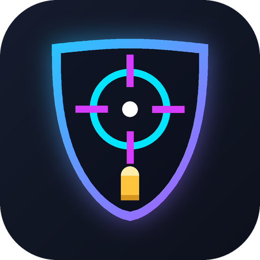

<div align="center">



# AssaultCube Solo Trainer

**Munitions et bouclier infinis pour AssaultCube, en Python.**
Un projet d'apprentissage de la lecture/écriture mémoire avec Cheat Engine et `pymem`.


</div>

---

## Présentation

Ce projet est né d'un exercice : **retrouver des adresses mémoire avec Cheat Engine, les rendre persistantes, puis automatiser leur modification en Python**.

Il cible [AssaultCube](https://assault.cubers.net/), un FPS open source gratuit, souvent utilisé pour s'initier à la rétro-ingénierie et au hacking mémoire parce qu'il est léger, sans protection anti-triche en solo, et très bien documenté.

## Avertissement

> **Ce projet est strictement éducatif et prévu pour le mode solo.**
> N'utilise jamais ces scripts en ligne ou sur des serveurs multijoueurs : tricher contre d'autres joueurs gâche leur partie et peut te faire bannir. Ne les utilise pas non plus sur un jeu commercial protégé par un anti-triche.

## Fonctionnalités

| Script | Effet | Offset |
|---|---|---|
| `bulletHack.py` | Munitions infinies (valeur verrouillée à 999) | `+0x140` |
| `shieldHack.py` | Bouclier toujours plein (valeur verrouillée à 100) | `+0xF0` |

Les deux scripts affichent en direct :
- l'état (actif ou en attente d'une partie) avec un spinner animé ;
- l'adresse de la structure du joueur ;
- la valeur réelle lue en mémoire ;
- le nombre d'écritures effectuées.

## Comment ça marche

Le jeu alloue la structure du joueur à une adresse **différente à chaque lancement**, donc une adresse trouvée avec Cheat Engine ne sert qu'une fois. Ce qui reste stable, c'est un **pointeur statique** situé à un décalage fixe du module `ac_client.exe`.

```
ac_client.exe + 0x17E0A8 ──► [ adresse de la structure du joueur ]
                                      │
                                      ├── + 0xF0   ──► bouclier
                                      └── + 0x140  ──► munitions
```

À chaque cycle, chaque script :
1. lit l'adresse de base du module `ac_client.exe` ;
2. lit le pointeur statique pour obtenir la base du joueur ;
3. ajoute l'offset de la valeur voulue ;
4. écrit la valeur (le jeu la fait baisser en tirant ou en encaissant des dégâts, donc on la réécrit en boucle).

Si le pointeur vaut `0` (menu, chargement de map), le script attend simplement la prochaine partie.

## Installation

Prérequis : **Windows**, **Python 3.8+** et AssaultCube installé.

```bash
pip install pymem colorama
```

## Utilisation

1. Lance AssaultCube et démarre une **partie solo**.
2. Ouvre un terminal (idéalement **en administrateur**) et lance le script voulu :

```bash
python bulletHack.py        # munitions infinies
python shieldHack.py        # bouclier infini
```

3. Appuie sur `Ctrl+C` pour arrêter.

Pour utiliser les deux effets en même temps, lance chaque script dans son propre terminal.

## Configuration

Toutes les valeurs sont regroupées en haut de chaque script :

| Constante | Rôle |
|---|---|
| `PROCESS_NAME` | Nom du processus du jeu (`ac_client.exe`) |
| `PLAYER_PTR_OFFSET` | Offset du pointeur statique vers la structure du joueur |
| `AMMO_OFFSET` / `SHIELD_OFFSET` | Offset de la valeur dans la structure du joueur |
| `AMMO_VALUE` / `SHIELD_VALUE` | Valeur imposée |
| `REFRESH_DELAY` | Pause entre deux écritures, en secondes |

## Retrouver les offsets soi-même

Les offsets dépendent de la **version du jeu**. Si les scripts restent « en attente » ou n'ont aucun effet, il faut les retrouver :

1. Scanne la valeur (balles, bouclier...) avec Cheat Engine jusqu'à isoler l'adresse.
2. Clic droit sur l'adresse → **Pointer scan for this address**.
3. Relance le jeu, retrouve la nouvelle adresse, puis utilise **Rescan memory** pour ne garder que les pointeurs encore valides. Répète 2 ou 3 fois.
4. Garde un chemin commençant par `"ac_client.exe"+...`, avec le moins de niveaux possible.
5. Recoupe entre plusieurs scans : un même pointeur qui donne des offsets différents selon la valeur (balles, bouclier...) est très probablement la base de la structure du joueur.

Évite les chemins qui commencent par `THREADSTACK` (pile, change à chaque lancement) ou par une DLL qui n'appartient pas au jeu.

## Créer un `.exe` avec le logo

```bash
pip install pyinstaller
pyinstaller --onefile --icon=cheat_logo.ico shieldHack.py
```

L'exécutable se trouve ensuite dans le dossier `dist/`.

## Dépannage

| Problème | Piste |
|---|---|
| `Jeu introuvable` | AssaultCube n'est pas lancé, ou le nom du processus est différent |
| `Impossible de s'attacher au processus` | Relance le terminal en administrateur |
| Reste sur « EN ATTENTE » en pleine partie | Les offsets ne correspondent pas à ta version : refais le pointer scan |
| Caractères mal affichés | Utilise Windows Terminal plutôt que l'ancien `cmd.exe` |
| Le jeu plante | Vérifie que tu es bien en solo et que les offsets sont corrects |

## Structure du projet

```
.
├── bulletHack.py        # munitions infinies
├── shieldHack.py        # bouclier infini
├── cheat_logo.ico       # icône (7 tailles, de 16 à 256 px)
├── cheat_logo.png       # logo pour ce README
└── README.md
```

## Pistes d'amélioration

- [ ] Ajouter la **vie** (offset à retrouver avec un nouveau pointer scan)
- [ ] Regrouper toutes les fonctions dans **un seul script** avec un dictionnaire d'offsets
- [ ] Ajouter des **touches d'activation** (F1, F2...) pour activer ou désactiver chaque effet
- [ ] Passer à un **AOB scan** pour survivre aux mises à jour du jeu
- [ ] Ajouter les autres armes (chaque arme a son propre offset)

## Ressources

- [Cheat Engine](https://www.cheatengine.org/) : scanner et éditeur mémoire
- [pymem](https://github.com/srounet/Pymem) : bibliothèque Python de lecture/écriture mémoire
- [colorama](https://pypi.org/project/colorama/) : couleurs dans le terminal
- [AssaultCube](https://assault.cubers.net/) : le jeu
